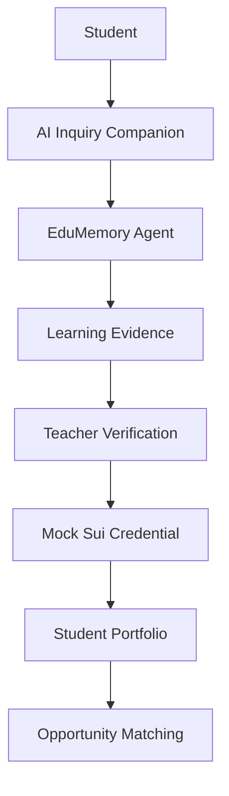
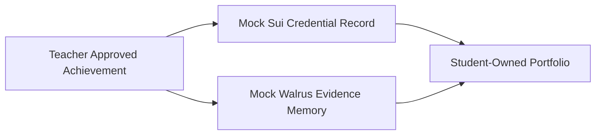

# EduMemory Architecture

EduMemory is an additive branch of AI Inquiry Companion. It preserves the existing teacher dashboard, student workflow, AI inquiry behavior, AI provider architecture, resource management system, UI, and navigation while adding a demo-ready learning passport workflow.

## High-Level Flow

## Components

### Student

The student completes classroom work, submits reflections, asks questions, uploads artifacts, and participates in activities such as engineering challenges, robotics, TSA competitions, and STEM clubs.

### AI Inquiry Companion

The existing inquiry assistant remains the core learning environment. It supports student conversation, reflection, feedback, and project-based learning without changing the current classroom workflow.

### EduMemory Agent

The EduMemory Agent observes learning signals from existing interactions. It is not a general chatbot. It watches for evidence of growth, analyzes skill development, and recommends verified achievements when the evidence is strong enough.

The agent is responsible for:

- Observing student conversations, reflections, submissions, and growth over time
- Analyzing skill development, misconceptions, improvement, and mastery patterns
- Acting by recommending next learning steps, suggesting achievements, and notifying teachers
- Preserving verified skills, achievements, reflections, and artifacts

### Learning Evidence

Learning evidence includes reflections, teacher notes, AI summaries, project artifacts, photos, videos, engineering notebooks, rubrics, and competition records. In the hackathon MVP, evidence is represented with realistic mock data.

### Teacher Verification

Teachers review AI-recommended achievements before anything becomes verified. This keeps the workflow credible and classroom-centered. The teacher can inspect the evidence summary, review the student artifact, and approve or reject the credential recommendation.

### Mock Sui Credential

After teacher approval, the system creates a mock Sui credential. In the demo, this represents student ownership, verifiability, and a permanent achievement record. Production blockchain infrastructure is intentionally deferred.

### Student Portfolio

The portfolio displays verified achievements, evidence history, STEM artifacts, robotics examples, TSA examples, and reflections. It is designed as a student-owned record that can travel across years and programs.

### Opportunity Matching

EduMemory uses the verified portfolio to recommend opportunities such as fellowships, summer academies, scholarships, competitions, internships, and nonprofit STEM programs.

## Mock Sui And Walrus Layer

Sui is used conceptually for credential ownership and verification. Walrus is used conceptually for long-term storage of learning artifacts and evidence. The hackathon branch prioritizes product clarity and impact over production chain integration.

## Data Model For Demo

- Student profile: Maya Rodriguez, 7th grade engineering student
- Reflection: Engineering design challenge reflection
- AI growth analysis: Improved use of constraints and iteration
- Teacher recommendation: Engineering Design Level 1
- Credential: Mock Sui credential with status, verifier, timestamp, and evidence hash
- Portfolio: Verified achievement list and artifact timeline
- Opportunities: NASA STEM Fellowship, Engineering Summer Academy, Robotics Leadership Scholarship
